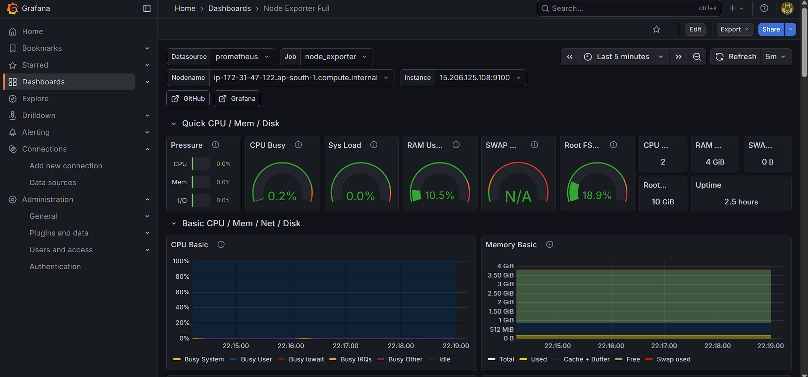
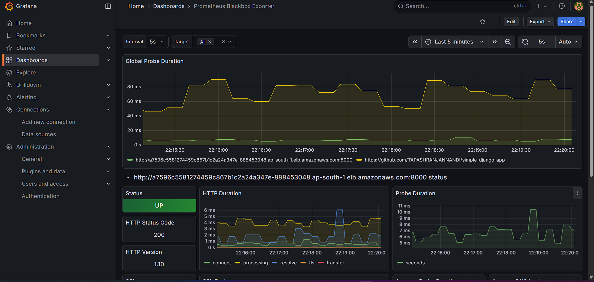

# Complete Monitoring & Server Configuration Guide (K8s + Prometheus + Grafana + Node Exporter + Blackbox Exporter)

This README provides the **full end‑to‑end setup** starting from Kubernetes deployment → Node Exporter → Prometheus → Blackbox Exporter → Grafana dashboards.

---

# 🚀 1. Server Configuration

## **Step 1: Create the Kubernetes Cluster**

Follow the steps in your `note-file.md` to create the Kubernetes cluster.

---

## **Step 2: Deploy Your Application in Kubernetes**

After deployment, get the service URL:

```bash
kubectl get svc -n development
```

Example Output:

```
NAME                        TYPE           CLUSTER-IP       EXTERNAL-IP                                                               PORT(S)          AGE
simple-django-app-service   LoadBalancer   10.100.143.164   a7596c5581274459c867b1c2a24a347e-888453048.ap-south-1.elb.amazonaws.com   8000:30334/TCP   84m
```

Your application URL becomes:

```
http://a7596c5581274459c867b1c2a24a347e-888453048.ap-south-1.elb.amazonaws.com:8000
```

---

# 🖥️ 2. Install Node Exporter (on Application Server)

Run the following commands:

```bash
wget https://github.com/prometheus/node_exporter/releases/download/v1.10.2/node_exporter-1.10.2.linux-amd64.tar.gz
tar -xvzf node_exporter-1.10.2.linux-amd64.tar.gz
cd node_exporter-1.10.2.linux-amd64
./node_exporter &
```

### **Allow these ports in AWS Security Group:**

| Purpose       | Port |
| ------------- | ---- |
| Application   | 8000 |
| Node Exporter | 9100 |
| HTTP          | 80   |

---

# 🔍 3. Monitoring Server Configuration

Log into the separate monitoring server.

## **Install Prometheus**

Download Prometheus:

```bash
wget https://github.com/prometheus/prometheus/releases/download/v3.8.0/prometheus-3.8.0.linux-amd64.tar.gz
tar -xvzf prometheus-3.8.0.linux-amd64.tar.gz
```

---

## **Install Blackbox Exporter**

```bash
wget https://github.com/prometheus/blackbox_exporter/releases/download/v0.28.0/blackbox_exporter-0.28.0.linux-amd64.tar.gz
tar -xvzf blackbox_exporter-0.28.0.linux-amd64.tar.gz
cd blackbox_exporter-0.28.0.linux-amd64
./blackbox_exporter &
```

---

# ⚙️ 4. Prometheus Configuration

Go inside:

```
prometheus-3.8.0.linux-amd64
```

Edit the **prometheus.yml** file with the following content:

```yaml
# my global config
global:
  scrape_interval: 15s
  evaluation_interval: 15s

# Alertmanager configuration
alerting:
  alertmanagers:
    - static_configs:
        - targets: []

# Load rules once and periodically evaluate them according to the global 'evaluation_interval'.
rule_files: []

scrape_configs:
  # ---------- PROMETHEUS SELF ----------
  - job_name: "prometheus"
    static_configs:
      - targets: ["localhost:9090"]
        labels:
          app: "prometheus"

  # ---------- NODE EXPORTER ----------
  - job_name: "node_exporter"
    static_configs:
      - targets: ["15.206.125.108:9100"]

  # ---------- BLACKBOX EXPORTER ----------
  - job_name: "blackbox"
    metrics_path: /probe
    params:
      module: [http_2xx]

    static_configs:
      - targets:
          - https://github.com/TAPASHRANJANNANDI/simple-django-app
          - http://a7596c5581274459c867b1c2a24a347e-888453048.ap-south-1.elb.amazonaws.com:8000

    relabel_configs:
      - source_labels: [__address__]
        target_label: __param_target

      - source_labels: [__param_target]
        target_label: instance

      - target_label: __address__
        replacement: 13.232.121.58:9115    # Blackbox exporter URL
```

### **Allow Ports in Monitoring Server**

| Purpose           | Port |
| ----------------- | ---- |
| Prometheus        | 9090 |
| Blackbox Exporter | 9115 |
| HTTP              | 80   |

---

# ▶️ 5. Start Prometheus

From inside the Prometheus directory:

```
./prometheus &
```

---

# 📊 6. Install Grafana on Monitoring Server

```bash
sudo apt-get install -y adduser libfontconfig1 musl
wget https://dl.grafana.com/grafana-enterprise/release/12.3.0/grafana-enterprise_12.3.0_19497075765_linux_amd64.deb
sudo dpkg -i grafana-enterprise_12.3.0_19497075765_linux_amd64.deb
```

### Allow port 3000

```bash
sudo ufw allow 3000
```

### Access Grafana

```
http://<public-ip>:3000/
```

Login → Set new password.

---

# 🔗 7. Add Prometheus as a Datasource in Grafana

Go to:
**Connections → Data sources → Prometheus**

Enter URL:

```
http://13.232.121.58:9090/
```

Click **Save & Test**.

---

# 📊 8. Import Dashboards

## **Node Exporter Dashboard**

1. Go to Dashboard → New → Import
2. Enter ID **1860**
3. Select Prometheus DS

### Screenshot



---

## **Blackbox Exporter Dashboard**

1. Dashboard → New → Import
2. Enter ID **7587**
3. Select Prometheus DS

### Screenshot



---

# ✅ Setup Complete!

You now have full monitoring of:

* Kubernetes cluster services
* Application endpoint monitoring
* Server metrics via Node Exporter
* Endpoint status via Blackbox Exporter
* Grafana dashboards for visualization

If you want, I can also create an **architecture diagram** or **flow chart** for this README.
